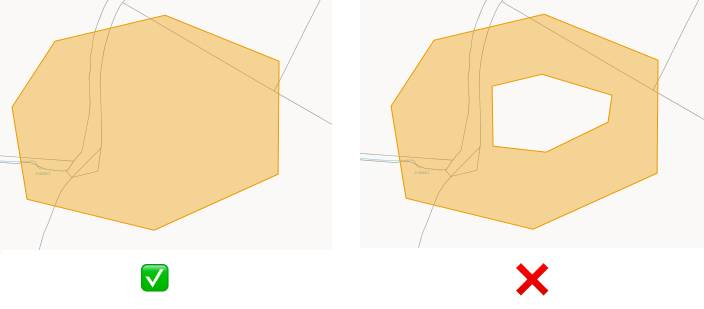

# 🪄 Enchanments

These are the enhancemenets that can be added to the application.

- Pagination can be added to `GET /logs` and `GET /areas` endpoints
- A new endpoint can be added to get logs for a specific area
- A new endpoint can be added to get logs for a specific user
- Hollow polygon support can be added
  
- Comprehensive tesging can be added
